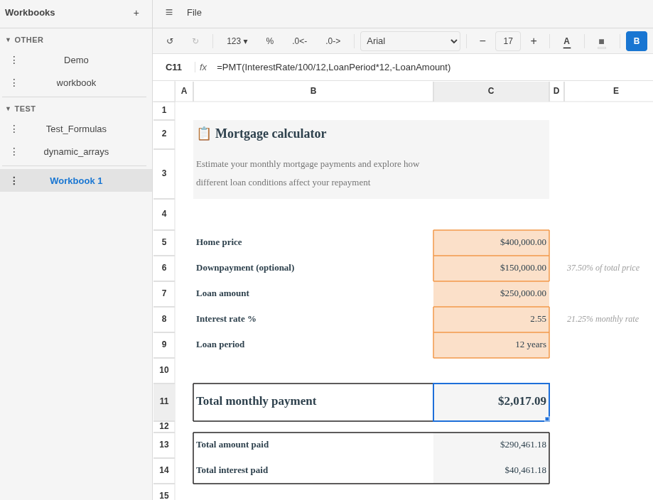

# RustyCalc

[](https://opensource.org/licenses/Apache-2.0)
[](https://opensource.org/licenses/MIT)




Alpha-stage spreadsheet built in Rust, compiled to WebAssembly. The calculation engine is [IronCalc](https://github.com/ironcalc/IronCalc), an Excel-compatible Rust engine vendored in `IronCalc/`. The grid is drawn by the in-tree [`iron-canvas`](iron-canvas/README.md) workspace: a read-only renderer with separate grid and overlay canvases. UI chrome, panels, and workbook state are [Leptos](https://leptos.dev/) in CSR mode.

**Status:** prototype. Editing, formulas, formatting, multi-sheet workbooks, named ranges, conditional formatting, camera snapshots, `.xlsx` import/export, and local persistence work. No charts, pivot tables, or collaborative editing.


## What works

- Cell editing with formula support (IronCalc parses and evaluates); multi-line cells (Alt+Enter) and CSE array formulas (Ctrl+Shift+Enter)
- `iron-canvas` renderer: frozen panes, selection, autofill drag, marching ants, grid lines, auto-fit row heights, error-cell formatting, conditional formatting (data bars, icon sets, color scales)
- Formula bar and in-cell editor with point-mode editing and colored formula-reference overlays for cell, range, and cross-sheet references; **F4** cycles absolute/relative `$`-flags on the ref under the caret (`A1` → `$A$1` → `A$1` → `$A1`)
- Draggable formula refs: each cell/range token in an edited formula paints an outlined handle in the canvas; drag the body to move, the edges to resize one axis, the corners to resize both. The formula text rewrites on mouseup.
- Named ranges and conditional formatting, with CRUD in non-modal right-side drawers and grid range-picking
- Toolbar with tabbed sections (Home / Data / View / File) and an overflow `⋯` menu when space is tight:
  - Home: undo/redo; number format (percent, increase/decrease decimals); font family, size (−/+), bold, italic, underline, strikethrough; text & background color; cell borders; horizontal/vertical alignment, text wrap, merge
  - Data: named ranges; conditional formatting
  - View: freeze panes; row/column header visibility; gridline visibility; camera snapshots of selected ranges
  - File: `.xlsx` import / export

- Sheet tab bar: add, rename, delete, hide/unhide, tab colors, context menus
- Right-click context menus on column and row headers (size, insert, delete, move, freeze)
- Column / row resize by dragging header borders
- Excel-style keyboard navigation and shortcuts (arrows, Ctrl+arrow, Shift+arrow, Page Up/Down, Home/End, Ctrl+B/I/U, Ctrl+Z/Y)
- Copy / paste (internal clipboard with structural paste, OS clipboard text fallback)
- Light / dark theme with `localStorage` persistence; canvas reads `--palette-*` from CSS
- Event-driven auto-save to `localStorage` (1 s debounce, 5 s maximum wait; immediate save on workbook switch)
- Sidebar workbook list with groups; double-click to rename
- Developer-only SVG and PDF export of the current sheet (`--features dev-tools`)
- Share URLs with verification (word-hash consent gate for untrusted payloads)
- Canvas recording and replay (`.icr` format) via dev-tools feature flag
- Optional Tauri desktop shell, GitHub Pages deployment

## Build

IronCalc is vendored as a git submodule. Clone with `--recurse-submodules`:

```
git clone --recurse-submodules https://github.com/CoalUnicorn/RustyCalc.git
```

If you already cloned without it, run `git submodule update --init`.

Requires [Trunk](https://trunkrs.dev/) and the `wasm32-unknown-unknown` target.

```sh
rustup target add wasm32-unknown-unknown
cargo install trunk
cargo install wasm-pack

trunk serve                              # dev server at localhost:8080/RustyCalc/
trunk build --release                    # production build to dist/
cargo tauri dev                          # optional desktop shell
cargo check --target wasm32-unknown-unknown
wasm-pack test --headless --firefox      # browser tests for the top-level crate
cd iron-canvas && cargo test --workspace # native renderer tests
```

CI (`.github/workflows/rustycalc.yml`) runs `cargo fmt`, `clippy`, and `check` on `wasm32-unknown-unknown`; browser tests are runnable locally but not yet wired into that workflow. The `iron-canvas` workspace has its own native test suite.

### Dev tools

```
trunk serve --features dev-tools
```

The `dev-tools` feature propagates to `iron-canvas-web/dev-tools`, which pulls in the `iron-canvas-recorder` crate and enables:

- Perf panel in the status bar with per-frame `commit_start → input_done → eval_done → render_done` timings.
- Canvas recording controls to start/stop capture of painter ops into an `.icr` (JSON) file you can save and replay.
- SVG and PDF download controls for the current sheet. PDF support is enabled through the internal `export` feature.

Replay a saved `.icr` by opening [`iron-canvas/web-test/recording-viewer.html`](iron-canvas/web-test/recording-viewer.html) and drag-dropping the file. See [`iron-canvas/web-test/README.md`](iron-canvas/web-test/README.md) for the standalone harness and viewer build instructions.

Without the feature flag, the recorder and its optional serialization dependency are not compiled into the wasm bundle, and the production build pays no recording cost.

## Docs

- [iron-canvas/README.md](iron-canvas/README.md), [iron-canvas/ARCHITECTURE.md](iron-canvas/ARCHITECTURE.md): renderer design
- [iron-canvas/web-test/README.md](iron-canvas/web-test/README.md): standalone smoke harness and `.icr` recording viewer
- [ARCHITECTURE.md](ARCHITECTURE.md): top-level Leptos ↔ IronCalc ↔ iron-canvas wiring
- [docs/state-and-events.md](docs/state-and-events.md): `WorkbookState`, `EventBus`
- [docs/leptos-patterns.md](docs/leptos-patterns.md): Leptos conventions
- [docs/building-components.md](docs/building-components.md): components
- [docs/adding-actions.md](docs/adding-actions.md): keyboard shortcuts and toolbar actions
- [docs/rust-style-guide.md](docs/rust-style-guide.md): type modeling
- [docs/testing-guide.md](docs/testing-guide.md): test setup
- [docs/performance-evaluation.md](docs/performance-evaluation.md): `mutate` vs `try_mutate`
- [styles/README.md](styles/README.md): CSS prefix map and component style layout
- [docs/modal.md](docs/modal.md): generic `Modal` dialog primitive

## Dependencies

- [IronCalc](https://github.com/ironcalc/IronCalc): engine (formula parsing, evaluation, OOXML)
- `iron-canvas` (in-tree): `<canvas>` grid renderer
- [Leptos](https://leptos.dev/) 0.8, [leptos-use](https://leptos-use.rs/) 0.19: reactive UI + browser hooks
- [Trunk](https://trunkrs.dev/): WASM build; [Tauri](https://tauri.app/) 2.x: optional desktop shell

# License

Licensed under either [MIT](https://opensource.org/licenses/MIT) or [Apache-2.0](https://opensource.org/licenses/Apache-2.0) at your option.

# Why

  - Mental health
  - I love and hate spreadsheets
  - I was the spreadsheet / "IT guy" in the office
  - I always dreamed of creating my own version
  - All in Rust? I like the language and tooling - learning exercise
