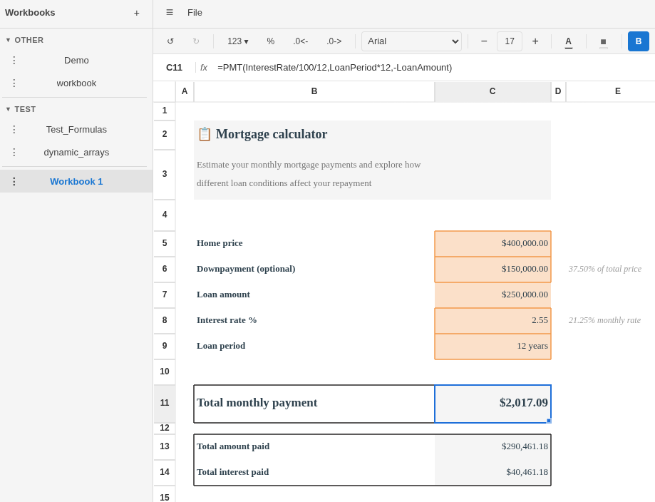

# RustyCalc

[](https://opensource.org/licenses/Apache-2.0)
[](https://opensource.org/licenses/MIT)




RustyCalc is an alpha spreadsheet for web browsers. It compiles to WebAssembly. It uses [IronCalc](https://github.com/ironcalc/IronCalc) for workbook data, formulas, and `.xlsx` files. It uses [`iron-canvas`](https://github.com/CoalUnicorn/iron-canvas) to draw the grid. `iron-canvas` is a separate repository that Cargo expects next to RustyCalc. The user interface uses [Leptos](https://leptos.dev/) 0.8 in client-side rendering mode.

**Status:** prototype. Editing, formulas, formatting, multi-sheet workbooks, named ranges, conditional formatting, `.xlsx` import/export, and local persistence work. No charts, pivot tables, or collaborative editing.


## What works

- Cell editing with formula support. IronCalc parses and evaluates formulas. Use Alt+Enter for a multi-line cell and Ctrl+Shift+Enter for an array formula.
- `iron-canvas` renderer: frozen panes, selection, autofill, animated copy border, grid lines, automatic row height, error cell styles, and conditional formatting (data bars, icon sets, color scales)
- Formula bar and in-cell editor with point-mode editing. Colored overlays mark cell, range, and cross-sheet references. Press **F4** to cycle the `$` flags on the reference at the caret (`A1` → `$A$1` → `A$1` → `$A1`).
- Drag a formula reference in the canvas to move it. Drag an edge or corner to resize a range. RustyCalc updates the formula when you release the mouse.
- Create, edit, and remove named ranges and conditional-formatting rules in side panels. Select a range from the grid.
- Toolbar with tabbed sections (Home / Data / View / File) and an overflow `⋯` menu when space is tight:
  - Home: undo/redo; number format (percent, increase/decrease decimals); font family, size (−/+), bold, italic, underline, strikethrough; text & background color; cell borders; horizontal/vertical alignment, text wrap, merge
  - Data: named ranges; conditional formatting
  - View: freeze panes; gridline visibility
  - File: `.xlsx` import and export; SVG and PDF exports of the visible sheet

- Sheet tab bar: add, rename, delete, hide/unhide, tab colors, context menus
- Right-click context menus on column and row headers (size, insert, delete, move, freeze)
- Column / row resize by dragging header borders
- Excel-style keyboard navigation and shortcuts (arrows, Ctrl+arrow, Shift+arrow, Page Up/Down, Home/End, Ctrl+B/I/U, Ctrl+Z/Y)
- Copy / paste (internal clipboard with structural paste, OS clipboard text fallback)
- Light / dark theme with `localStorage` persistence; canvas reads `--palette-*` from CSS
- Event-driven auto-save to `localStorage` (1 s debounce, 5 s maximum wait; immediate save on workbook switch)
- Sidebar workbook list with groups; double-click to rename
- Share links, with an optional verification word
- Optional Tauri desktop shell, GitHub Pages deployment

## Build

RustyCalc uses IronCalc as a Git submodule. It also uses the separate `iron-canvas` repository. Clone both repositories into the same parent directory:

```sh
git clone --recurse-submodules https://github.com/CoalUnicorn/RustyCalc.git
git clone https://github.com/CoalUnicorn/iron-canvas.git
cd RustyCalc
```

If you already cloned RustyCalc, run `git submodule update --init` from its directory. From RustyCalc's parent directory, clone `iron-canvas` beside it if no checkout exists there. The RustyCalc manifest uses the relative path `../iron-canvas`.

Install the `wasm32-unknown-unknown` target, [Trunk](https://trunkrs.dev/), and `wasm-pack`:

```sh
rustup target add wasm32-unknown-unknown
cargo install trunk
cargo install wasm-pack

trunk serve                              # dev server at localhost:8080/RustyCalc/
trunk build --release                    # production build to dist/
cargo check --target wasm32-unknown-unknown
wasm-pack test --headless --firefox      # browser tests for the top-level crate
cd ../iron-canvas && cargo test --workspace # native renderer tests
```

CI (`.github/workflows/rustycalc.yml`) runs `cargo fmt --check`, `cargo clippy`, and `cargo check` for `wasm32-unknown-unknown`. Browser tests run locally but are not part of that workflow. Install Firefox to run the browser test command. The `iron-canvas` repository has its own native test suite.

For the optional Tauri shell, install the [Tauri CLI](https://tauri.app/start/) and the required system packages, then run `cargo tauri dev`.

## Docs

- [iron-canvas README](https://github.com/CoalUnicorn/iron-canvas/blob/main/README.md): renderer overview and architecture
- [iron-canvas web-test guide](https://github.com/CoalUnicorn/iron-canvas/blob/main/web-test/README.md): standalone browser harness and recording viewer
- [docs/state-and-events.md](docs/state-and-events.md): `WorkbookState`, `EventBus`
- [docs/leptos-patterns.md](docs/leptos-patterns.md): Leptos conventions
- [docs/building-components.md](docs/building-components.md): components
- [docs/adding-actions.md](docs/adding-actions.md): keyboard shortcuts and toolbar actions
- [docs/rust-style-guide.md](docs/rust-style-guide.md): type modeling
- [docs/testing-guide.md](docs/testing-guide.md): test setup
- [docs/performance-evaluation.md](docs/performance-evaluation.md): `mutate` vs `try_mutate`
- [styles/README.md](styles/README.md): CSS prefix map and component style layout
- [docs/modal.md](docs/modal.md): generic `Modal` dialog primitive

## Dependencies

- [IronCalc](https://github.com/ironcalc/IronCalc): engine (formula parsing, evaluation, OOXML)
- [iron-canvas](https://github.com/CoalUnicorn/iron-canvas): Rust grid renderer, checked out next to this repository
- [Leptos](https://leptos.dev/) 0.8, [leptos-use](https://leptos-use.rs/) 0.19: reactive UI + browser hooks
- [Trunk](https://trunkrs.dev/): WASM build; [Tauri](https://tauri.app/) 2.x: optional desktop shell

## License

Licensed under either [MIT](https://opensource.org/licenses/MIT) or [Apache-2.0](https://opensource.org/licenses/Apache-2.0) at your option.
